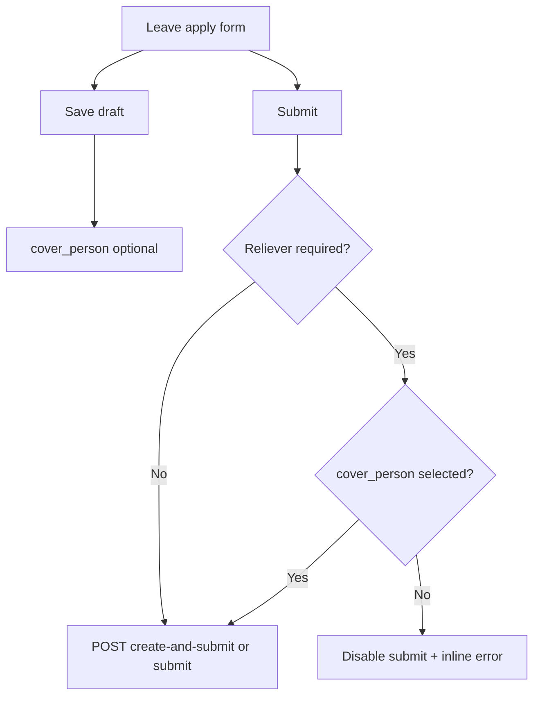

# Leave Reliever UI — Frontend Agent Prompt

Self-contained prompt for an AI coding agent to align the **Leave application UI** in `incel-hrm-frontend` with the new **org-scoped reliever (cover person)** backend rules.

**Backend:** Read-only reference in `../incel-hrm-backend/` (already implemented).  
**Do not** change backend code unless the user explicitly asks.

---

## How to use this prompt

1. Work **only** in `incel-hrm-frontend`.
2. Copy the **Agent task** section below into a fresh agent session, or reference this file directly.
3. After implementation: run `npm run lint` and `npm run build` from `incel-hrm-frontend/`, then smoke-test `/leave/apply` and `/leave/requests/[id]`.
4. All API calls go through the existing BFF: `lib/api-client.ts` → `/api/proxy/{path}` with `credentials: "include"`.
5. API paths below are **proxy paths** (no `/api/v1/` prefix in the client).

---

## Agent task

### Context

The backend (`incel-hrm-backend`) now enforces **org-scoped reliever (cover person)** rules. The frontend currently loads relievers from **department members** (`useDepartmentMembers`) and treats reliever as **optional**. That is out of date.

**Your job:** Update the leave application UI to match the new backend contract.

**Frontend repo path:** `incel-hrm-frontend/`

---

### Backend behavior summary

| Rule | Behavior |
|------|----------|
| **When required** | Reliever is required at **submit** and **create-and-submit**, not when saving a **DRAFT** |
| **Exempt leave types** | Sick, Maternity, Paternity — no reliever needed |
| **Emergency exempt** | `is_emergency: true` waives reliever for **non-Sick** types only |
| **Role exempt** | Managing Director / Executive Director requesters — no reliever needed |
| **Org scope** | Relievers must be colleagues in the requester's lowest org level: **team → unit → department** |
| **Cascade fallback** | If no colleagues at primary scope, pool widens: team → unit → department |
| **Availability** | Reliever cannot have **APPROVED** leave overlapping requested dates |
| **HR override** | HR can assign **any active user** (cross-department) when PATCHing a leave request |

---

### New API endpoint (use this for reliever picker)

```
GET leave-requests/eligible-relievers/
```

**Auth:** Required (current user)

**Response:**

```json
{
  "scope_level": "team",
  "effective_scope_level": "department",
  "fallback_applied": true,
  "relievers": [
    {
      "id": "uuid",
      "email": "user@test.com",
      "first_name": "Jane",
      "last_name": "Doe"
    }
  ]
}
```

| Field | Meaning |
|-------|---------|
| `scope_level` | Primary org level resolved for the user (`team` \| `unit` \| `department` \| `null`) |
| `effective_scope_level` | Level actually used after cascade |
| `fallback_applied` | `true` when widened beyond primary scope |
| `relievers` | Eligible colleagues (excludes self) |

**Do not** use `departments/:id/members/` for the reliever picker on employee flows.

---

### Existing endpoints (unchanged paths, new validation)

| Action | Endpoint | Reliever note |
|--------|----------|---------------|
| Save draft | `POST leave-requests/` | `cover_person` optional |
| Submit draft | `POST leave-requests/:id/submit/` | Reliever required when applicable |
| Create + submit | `POST leave-requests/create-and-submit/` | Reliever required when applicable |
| Update | `PATCH leave-requests/:id/` | Employee: org-scoped; HR: any active user |

**Payload field:** `cover_person` — UUID string or omit/null on draft

**Common backend errors (display on `cover_person` field):**

- `"A reliever is required before submitting this leave request."`
- `"The reliever must be an active colleague in your team."` (or `unit` / `department`)
- `"The selected reliever already has approved leave that overlaps with the requested dates."`
- `"You cannot assign yourself as the cover person."`

---

### Files to update

#### 1. `lib/types/leave.ts`

Add:

```ts
export interface EligibleRelieversResponse {
  scope_level: "team" | "unit" | "department" | null;
  effective_scope_level: "team" | "unit" | "department" | null;
  fallback_applied: boolean;
  relievers: EmployeeMinimal[];
}
```

Update `LeaveRequest.cover_person` read shape to prefer nested object:

```ts
cover_person?: EmployeeMinimal | null;
```

#### 2. `lib/api/leave.ts`

- Add query key: `eligibleRelievers: ["leave-eligible-relievers"]`
- Add hook:

```ts
export function useEligibleRelievers(options?: { enabled?: boolean }) {
  return useQuery({
    queryKey: leaveKeys.eligibleRelievers,
    queryFn: () => apiGet<EligibleRelieversResponse>("leave-requests/eligible-relievers/"),
    enabled: options?.enabled ?? true,
  });
}
```

#### 3. `lib/leave/reliever.ts` (new helper — recommended)

Mirror backend `reliever_required` for client-side UX (server still enforces):

```ts
import { hasRole } from "@/lib/rbac";
import type { User } from "@/lib/types/auth"; // adjust import to match project

const EXEMPT_TYPES = ["Sick", "Maternity", "Maternity Leave", "Paternity", "Paternity Leave"];

export function isRelieverRequired(params: {
  leaveTypeName: string;
  isEmergency: boolean;
  user: User | null;
}): boolean {
  if (hasRole(params.user, "MANAGING_DIRECTOR", "EXECUTIVE_DIRECTOR")) {
    return false;
  }
  if (EXEMPT_TYPES.includes(params.leaveTypeName)) return false;
  if (params.isEmergency && params.leaveTypeName !== "Sick") return false;
  return true;
}

export function relieverScopeLabel(level: string | null): string {
  if (level === "team") return "team";
  if (level === "unit") return "unit";
  if (level === "department") return "department";
  return "organisation";
}

export function formatRelieverName(person: {
  first_name?: string;
  last_name?: string;
  email?: string;
}): string {
  const name = `${person.first_name ?? ""} ${person.last_name ?? ""}`.trim();
  return name || person.email || "Unknown";
}
```

#### 4. `app/(hrm)/leave/apply/page.tsx`

**Replace** `useDepartmentMembers` reliever logic with `useEligibleRelievers`.

**UX changes:**

- Reliever field:
  - **Optional** for “Save as draft”
  - **Required** for “Submit” when `isRelieverRequired(...)` is true
- Remove label “(optional)” when reliever is required for submit
- Populate dropdown from `eligibleRelievers.relievers`
- Display helper text based on scope:
  - Normal: `Showing colleagues in your {effective_scope_level}.`
  - Fallback: `No colleagues in your {scope_level}; showing colleagues from your {effective_scope_level}.`
  - Empty: `No eligible relievers found. Contact HR.`
- Update `canSubmit` for submit button:

```ts
const relieverRequired = isRelieverRequired({
  leaveTypeName: selectedLeaveType?.name ?? "",
  isEmergency: false,
  user,
});
const canSubmit =
  baseFieldsValid && (!relieverRequired || !!coverPersonId);
```

- Keep `canSaveDraft` without reliever requirement
- Map API `cover_person` validation errors to the reliever field
- Update Annual/Casual hint: exclusivity is org-scoped (team/unit/dept), not always department-wide

#### 5. `app/(hrm)/leave/requests/[id]/page.tsx`

**Employee draft edit:**

- Replace `useDepartmentMembers` with `useEligibleRelievers` for reliever dropdown
- `canSubmit` for draft submit: require reliever only when `isRelieverRequired` for selected leave type
- Display selected reliever name from `request.cover_person` nested object when read-only

**HR edit flow (if HR can PATCH on this page):**

- When `hasRole(user, "HR")` and editing **another employee's** request:
  - Use a broader user search/list (existing users API — HR backend accepts any active user)
  - Do not restrict to `eligible-relievers` (that endpoint is scoped to **current** user, not the applicant)

#### 6. `lib/tutorials/definitions/leave.ts`

Update reliever tour step:

- Title: **“Reliever”** (not “optional”)
- Description: explain org-scoped selection, required before submit for most leave types, optional on draft

---

### UX flow



**Reliever dropdown display name:** use `formatRelieverName()` — backend does not return `full_name` on eligible-relievers.

**Read-only detail view:** Show reliever as `cover_person.first_name cover_person.last_name` when nested object is present.

---

### What to remove

- Do **not** use `useDepartmentMembers(deptId)` for employee reliever picker on:
  - `/leave/apply`
  - `/leave/requests/[id]` (employee draft edit)
- Remove copy implying reliever is always optional or always department-scoped

---

### Edge cases to handle in UI

1. **User has no department** — show message; reliever picker may be empty; submit will fail server-side
2. **Sole member at all levels** — empty `relievers[]`; block submit with “Contact HR”
3. **User changes leave type** — re-evaluate `isRelieverRequired`; clear reliever requirement UI for Sick/Maternity/Paternity
4. **Emergency flag** — if you add an emergency toggle later, non-Sick + emergency = reliever not required
5. **MD/ED users** — hide reliever requirement and field (or show as optional with explanation)
6. **Invalid reliever after org change** — if saved draft has reliever outside new scope, show backend error on submit and prompt re-selection

---

### Testing checklist

- [ ] Apply page: save Annual draft **without** reliever → succeeds
- [ ] Apply page: submit Annual **without** reliever → blocked in UI; backend returns 400 if bypassed
- [ ] Apply page: submit Annual **with** valid reliever from eligible-relievers → succeeds
- [ ] Apply page: reliever from different team (not in eligible list) cannot be selected
- [ ] Apply page: fallback message when `fallback_applied: true`
- [ ] Submit Sick without reliever → succeeds
- [ ] Draft detail page: submit without reliever fails for Annual; succeeds for Sick
- [ ] Display backend error when reliever is on overlapping approved leave
- [ ] HR PATCH (if supported in UI): can assign user outside applicant's department
- [ ] Tutorial copy updated

---

### Constraints

- Match existing Stitch/design patterns (`stitchSelectClass`, `FieldLabel`, `data-tour` attributes)
- Use React Query patterns already in `lib/api/leave.ts`
- Use `hasRole` from `lib/rbac.ts` for role checks
- Server is source of truth — client validation is for UX only
- Do not edit backend code or this prompt file unless asked

---

### Reference backend files (read-only)

| File | What to read |
|------|----------------|
| `../incel-hrm-backend/apps/leave/services.py` | `get_eligible_relievers`, `reliever_required` |
| `../incel-hrm-backend/apps/leave/views.py` | `eligible_relievers` action |
| `../incel-hrm-backend/README.md` | Business rules §2 (reliever required at submit) |

---

### Current frontend files that need changes (starting point)

| File | Current behavior |
|------|------------------|
| `app/(hrm)/leave/apply/page.tsx` | Uses `useDepartmentMembers`; reliever labeled optional; submit does not require reliever |
| `app/(hrm)/leave/requests/[id]/page.tsx` | Uses `useDepartmentMembers`; `canSubmit` requires `cover_person` whenever `deptId` exists |
| `lib/api/leave.ts` | No `useEligibleRelievers` hook |
| `lib/types/leave.ts` | No `EligibleRelieversResponse` type |
| `lib/tutorials/definitions/leave.ts` | Tour says “Reliever (optional)” |
